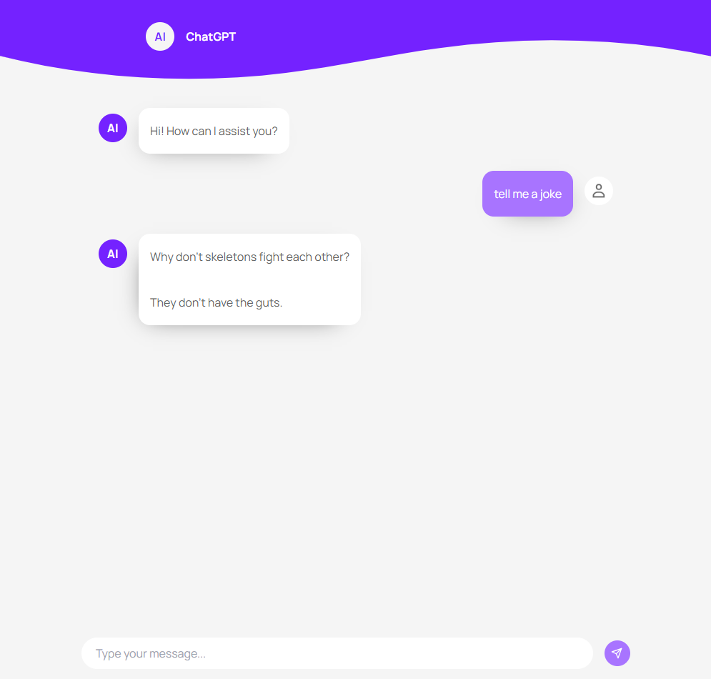

# Vestlusrobot Next.js'ga

Lihtne vestlusroboti kasutajaliides (Next.js tehnoloogiaga), mis kasutab Vercel AI SDK'd ning OpenAI API't. Rakenduse eesmärk on võimaldada kasutajatel vestelda AI-ga, esitades küsimusi ja saades vastuseid. 



## Rakenduse käivitamine arenduseks:

```bash
npm run dev
```

Rakendusele on võimalik ligipääseda veebibrauserilt sellelt lingilt: [http://localhost:3000](http://localhost:3000)

## Koodi struktuur

Kasutasin `app` kausta `Next.js`-i rakenduse põhistruktuurina, mis on ka `Vercel`-i poolt soovitatud, kuna see võimaldab selgelt eristada lehekülgi ja `API` päringuid. Iga `UI` komponent on omas failis `components` kaustas, mis muudab nende arendamise ja testimise lihtsamaks, kuna komponendi loogika ja stiilid on eraldatud muust koodist. See koodistruktuur aitab hoida projekti skaleeritavana, võimaldades vajadusel komponente hõlpsasti muuta või uuesti kasutada, ilma et see mõjutaks ülejäänud koodi.

Kuna tegemist on väikese projektiga, on oluline hoida koodistruktuur võimalikult lihtsana. Liigne kaustade jaotus võib segadust tekitada ja muuta projekti raskemini hallatavaks.

## Kasutajasõbralikkus

Kasutajaliidese inspiratsioon on võetud `OpenAI` `ChatGPT` lahendusest, mis on tuntud oma intuitiivsuse ja lihtsa kasutuskogemuse poolest. Rakenduses on oluline, et kasutaja saaks vestlusrobotiga suhelda võimalikult mugavalt seega mõistlik on kasutada juba olemasolevaid ja tuttavaid lahendusi. Tekstiala (textarea) suuruse dünaamiline muutmine (Shift+Enter suurendab ja Shift+Backspace vähendab) aitab kasutajal hõlpsasti kirjutada ja redigeerida pikemaid sõnumeid ilma ekraaniruumi raiskamata. 

## Värviskeem ja tüpograafia

Valitud värviskeem on lihtne, kuid tõhus – see koosneb `lillast` ja `valgest`. Lilla värv sümboliseerib loovust ja innovatsiooni, mis seostub hästi vestlusroboti AI teemaga. Valge taust loob selge ja puhta välimuse, mis aitab kasutajatel keskenduda vestlusele ilma liigsete segajateta.

Valitud tüpograafia on lihtne ja kaasaegne, keskendudes loetavusele. Kasutatud font `Manrope` on `sans-serif` stiilis, mis on optimeeritud erinevate seadmete ja ekraanisuuruste jaoks. Suur rõhk on pandud kontrastile ja tähemärkide selgusele, et tekst oleks hästi loetav ka väiksemates seadmetes.

## Disaini lähenemine 

`Tailwind CSS`-i valik võimaldab kiiret ja tõhusat prototüüpimist, mis on oluline väikeste projektide puhul, kus aeg on piiratud. `Tailwind` võimaldab kasutada eelloodud klasse, mis vähendavad vajadust luua keerulisi kohandatud CSS-klasse, samas tagades järjepideva ja hästi struktureeritud stiilide rakendamise kogu rakenduses. Kuigi `Tailwind` võib pikemas perspektiivis muuta `HTML`-i vähem loetavaks, kaalub selle pakutav paindlikkus ja kiirus selle puuduse üles.

## Testimine

Testimise jaoks kasutaksin `Jest` ja `Cypress` raamistikke, et tagada rakenduse töökindlust ja stabiilsust. `Jest`-i kasutamine võimaldab kirjutada `unit test`-e, mis kontrollivad väikseid koodiosasid, nagu üksikud funktsioonid ja komponendid. `Cypress`-i kasutamine on suurepärane valik funktsionaalsete ja kasutajaliidese testide jaoks, kuna see võimaldab simuleerida kasutaja tegevusi ja testida kogu kasutajavoogu.

## Ohud ja riskid

`Cross-Site Scripting (XSS)` rünnakud on tavalised veebirakendustes, kus kasutajad saavad sisestada andmeid. Selle riski maandamiseks on oluline, et kõik kasutaja sisestused puhastatakse ja valideeritakse enne nende kuvamist või töötlemist. Kasutades turvameetmeid, nagu sisu turvapoliitika (`Content Security Policy, CSP`), saab piirata kolmandate osapoolte skriptide täitmist, mis vähendab rünnakute riski.

`API`-de kasutamisel tuleb arvestada ka võimalike tõrgetega, nagu võrguühenduse vead või päringute limiidid. Selleks luuakse rakendustele veahaldus, mis kuvab kasutajale selgeid ja sõbralikke veateateid, kui midagi valesti läheb.

## Optimeerimine

Rakenduse jõudluse optimeerimiseks ja kasutajakogemuse parandamiseks kasutasin `@vercel/speed-insights` tööriista. See tööriist pakub väärtuslikku teavet lehekülje laadimisaja kohta ja annab soovitusi, kuidas seda veelgi vähendada. Kiire lehe laadimisaeg on kriitiline, et hoida kasutajaid kaasatuna ja vältida kõrget loobumismäära.
